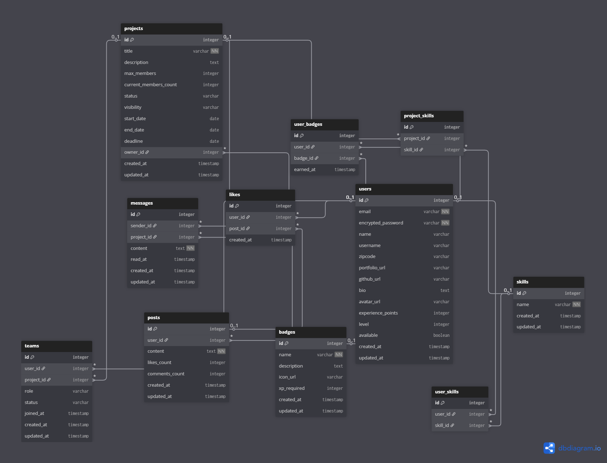

<div align="center">

# NexP

### Plateforme collaborative nouvelle génération pour développeurs

[](https://www.ruby-lang.org/)
[](https://rubyonrails.org/)
[](https://www.postgresql.org/)
[](LICENSE)

[Contribuer](#-contribuer)

</div>

---

## Table des matières

- [À propos](#à-propos)
- [Fonctionnalités](#fonctionnalités)
- [Stack technique](#stack-technique)
- [Architecture](#architecture)
- [Installation](#installation)
- [Utilisation](#utilisation)
- [Base de données](#base-de-données)
- [API](#api)
- [Tests](#tests)
- [Déploiement](#déploiement)
- [Contribuer](#contribuer)
- [Roadmap](#roadmap)
- [License](#license)

---

## À propos

**NexP** est une plateforme collaborative conçue pour connecter les développeurs autour de projets communs. Elle permet de :

- **Découvrir** des projets en fonction de ses compétences
- **Collaborer** avec d'autres devs en temps réel
- **Suivre** l'avancement des projets via un dashboard intuitif
- **Gagner** des badges en fonction de vos contributions
- **Échanger** via un système de messagerie intégré

---

## Fonctionnalités

### MVP (Phase 1)

- [x] Authentification utilisateur (Devise)
- [x] Gestion des profils développeurs
- [x] Système de compétences (skills)
- [x] Création et gestion de projets
- [x] Équipes et collaborations
- [x] Messagerie interne
- [x] Feed social (posts + likes)

### Fonctionnalités avancées (Phase 2)

- [ ] Matching automatique projet/développeur (ML)
- [ ] Système de badges et gamification
- [ ] Notifications temps réel (ActionCable)
- [ ] API REST complète
- [ ] Dashboard analytics
- [ ] Intégrations GitHub/GitLab
- [ ] Mode sombre

---

## Stack technique

### Backend

| Technologie | Version | Usage |
|-------------|---------|-------|
| Ruby | 3.3.6 | Langage principal |
| Rails | 8.0.1 | Framework web |
| PostgreSQL | 17 | Base de données |
| Devise | 4.9 | Authentification |
| Puma | 6.5 | Serveur web |

### Frontend

| Technologie | Version | Usage |
|-------------|---------|-------|
| Hotwire | - | Interactivité |
| Stimulus | 3.2 | JavaScript framework |
| Tailwind CSS | 3.4 | Styling |
| ImportMap | - | Gestion JS |

### DevOps

- **Docker** : Containerisation
- **GitHub Actions** : CI/CD
- **PostgreSQL** : Base de données
- **Redis** : Cache & sessions (à venir)

---

## Architecture

### Structure de la base de données



**Modèles principaux :**

- **User** : Développeur avec compétences et portfolio
- **Project** : Projet collaboratif avec équipe
- **Team** : Association user ↔ project avec rôles
- **Skill** : Compétences techniques (tags)
- **Message** : Messagerie interne projet
- **Post** : Feed social + likes
- **Badge** : Système de gamification

---

## Installation

### Prérequis

- Ruby 3.3.6
- Rails 8.0.1
- PostgreSQL 17
- Node.js 20+ (pour Tailwind/Stimulus)

### Setup

```bash
# Clone le repo
git clone https://github.com/greegs0/nexp.git
cd nexp

# Install dependencies
bundle install
yarn install

# Setup database
rails db:create
rails db:migrate
rails db:seed

# Lancer le serveur
bin/dev
```

L'app sera dispo sur http://localhost:3000

---

## Utilisation

### Créer un compte

```ruby
# Via la console
rails console
User.create!(
  email: "dev@example.com",
  password: "password123",
  name: "John Doe",
  username: "johndoe"
)
```

### Ajouter des skills

```ruby
user = User.first
user.skills.create!(name: "Ruby on Rails")
user.skills.create!(name: "React")
```

### Créer un projet

```ruby
project = Project.create!(
  title: "Super SaaS",
  description: "Plateforme de gestion de projets",
  owner: user,
  max_members: 5,
  status: "open"
)
```

---

## Base de données

### Migrations principales

```bash
# Voir l'état des migrations
rails db:migrate:status

# Rollback dernière migration
rails db:rollback

# Reset complet
rails db:reset
```

### Modèles clés

| Modèle | Description | Relations |
|--------|-------------|-----------|
| User | Profil développeur | has_many :projects, has_many :skills |
| Project | Projet collaboratif | belongs_to :owner, has_many :teams |
| Team | Membre d'un projet | belongs_to :user, belongs_to :project |
| Skill | Compétence technique | belongs_to :user |
| Message | Message interne | belongs_to :sender, belongs_to :project |
| Post | Publication sociale | belongs_to :user, has_many :likes |
| Badge | Badge gamification | has_many :user_badges |

---

## API

### Endpoints (Phase 2)

Documentation complète à venir. Endpoints prévus :

```
GET    /api/v1/projects          # Liste des projets
POST   /api/v1/projects          # Créer un projet
GET    /api/v1/projects/:id      # Détails d'un projet
PATCH  /api/v1/projects/:id      # Modifier un projet
DELETE /api/v1/projects/:id      # Supprimer un projet

GET    /api/v1/users             # Liste des devs
GET    /api/v1/users/:id         # Profil d'un dev
PATCH  /api/v1/users/:id         # Modifier son profil
```

---

## Tests

### Lancer les tests

```bash
# Tous les tests
rails test

# Tests spécifiques
rails test test/models/user_test.rb

# Avec couverture
COVERAGE=true rails test
```

### Coverage attendue

- Models : 90%+
- Controllers : 80%+
- Global : 85%+

---

## Déploiement

### Heroku

```bash
# Login
heroku login

# Créer l'app
heroku create nexp-production

# Ajouter PostgreSQL
heroku addons:create heroku-postgresql:essential-0

# Deploy
git push heroku main

# Migrations
heroku run rails db:migrate
heroku run rails db:seed
```

### Render / Fly.io

Documentation à venir.

---

## Contribuer

Les contributions sont les bienvenues ! Voici comment procéder :

1. Fork le projet
2. Créer une branche feature (`git checkout -b feature/AmazingFeature`)
3. Commit vos changements (`git commit -m 'Add: Amazing feature'`)
4. Push vers la branche (`git push origin feature/AmazingFeature`)
5. Ouvrir une Pull Request

### Guidelines

- Suivre les conventions Ruby/Rails
- Ajouter des tests pour les nouvelles features
- Documenter les changements importants
- Respecter le style de code existant

---

## Roadmap

### Q1 2025

- [x] Setup projet Rails 8
- [x] Modèles de données
- [ ] Interface utilisateur MVP
- [ ] Système de messagerie

### Q2 2025

- [ ] Matching automatique
- [ ] Gamification complète
- [ ] API REST v1
- [ ] Dashboard analytics

### Q3 2025

- [ ] Intégrations Git
- [ ] Mode sombre
- [ ] Mobile app (React Native ?)

---

## License

Ce projet est sous licence MIT. Voir le fichier [LICENSE](LICENSE) pour plus de détails.

---

## Auteur

**Greg** - [@greegs0](https://github.com/greegs0)

---

<div align="center">

Fait avec mass et mass par la communauté dev

[Retour en haut](#nexp)

</div>
